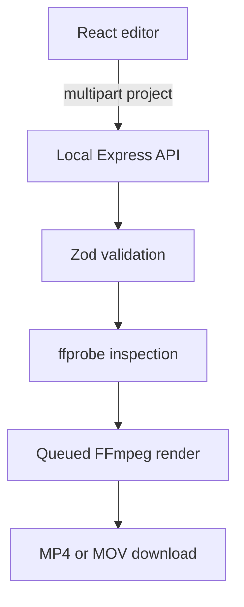

# Production FFmpeg Renderer

The production renderer is a local Node.js companion service for Advanced Presenter FX. The browser remains responsible for editing and preview. The service receives the selected local media plus a versioned project manifest, validates the request, builds a deterministic FFmpeg filter graph, and produces an MP4 or MOV file.

## Architecture



The default server address is `http://127.0.0.1:4178`. It intentionally binds to loopback so uploaded media never leaves the Mac. A non-loopback bind is rejected unless `ALLOW_REMOTE_RENDER_SERVER=true`; that override must only be used behind authentication and TLS.

## Render pipeline

1. Multer streams uploads to an isolated temporary directory instead of buffering large videos in memory.
2. Zod validates project version, timeline bounds, output settings, colours, subtitle cues, and Presenter FX coordinates.
3. `ffprobe` confirms the audio and visual streams before rendering.
4. Every visual is normalized to the requested 16:9 resolution and frame rate.
5. Images receive optional Ken Burns animation; videos loop when shorter than their timeline slot.
6. FFmpeg `xfade` transitions join the normalized segments without shortening the intended timeline.
7. ASS overlays render captions, text watermarks, captured cursor samples, and pen/highlighter paths.
8. The primary audio is optionally normalized to −14 LUFS and encoded with the selected delivery preset.
9. Progress is read from FFmpeg's machine-readable progress channel. Jobs can be cancelled and expire after six hours.

## Presets

| Preset | Container | Encoder | Intended use |
|---|---|---|---|
| High Quality | MP4 | `libx264`, CRF 17, slow | Final YouTube and social upload |
| Balanced | MP4 | `libx264`, CRF 20, medium | Faster general delivery |
| Apple Silicon | MP4 | `h264_videotoolbox` | Fast hardware rendering on supported Macs |
| ProRes 422 HQ | MOV | `prores_ks`, 10-bit 4:2:2 | Editing master and archival handoff |

All MP4 presets use AAC audio, 48 kHz, and `faststart`. The software presets generally offer better compression efficiency; the VideoToolbox preset prioritizes speed.
The ProRes path keeps compositing in 10-bit 4:4:4 and converts to 10-bit 4:2:2 only at the encoder, avoiding an unnecessary 4:2:0 intermediate.

## API

### `GET /api/health`

Returns FFmpeg version, supported encoders and required filters. The frontend uses this to enable only available export modes.

### `POST /api/renders`

Accepts `multipart/form-data`:

- `project`: version 1 project JSON
- `audio`: primary audio or a video containing the primary audio stream
- `asset_0` … `asset_N`: images and video clips referenced by the manifest
- `logo`: optional image watermark

Returns HTTP `202` with job, status, progress-event and download URLs.

### `GET /api/renders/:id`

Returns `queued`, `running`, `completed`, `failed`, or `cancelled`, plus numeric progress.

### `GET /api/renders/:id/events`

Server-sent progress events for clients that prefer streaming updates. The current UI uses polling so it remains reliable across restrictive browser configurations.

### `DELETE /api/renders/:id`

Cancels a queued or running job. Running FFmpeg processes receive `SIGTERM` followed by `SIGKILL` after five seconds if necessary.

### `GET /api/renders/:id/download`

Streams the completed MP4 or MOV using a safe filename and correct media type.

## Configuration

The service reads environment variables directly. See `.env.example` for supported values. Environment files are not loaded automatically, which avoids adding hidden configuration behavior; export variables through the shell or a process manager.

For a Homebrew FFmpeg installed outside `PATH`:

```bash
FFMPEG_PATH=/opt/homebrew/bin/ffmpeg \
FFPROBE_PATH=/opt/homebrew/bin/ffprobe \
npm start
```

## Presenter FX fidelity

During ordinary preview playback, the frontend records normalized, timestamped cursor samples and completed pen/highlighter paths. The deterministic renderer recreates these as resolution-independent ASS overlays. Preview once before export to capture them.

The interactive magnifier reads pixels from the live canvas, and manual clip switching changes the timeline while it is playing. Those two interactions remain in **Live WebM Capture**. Production FFmpeg export deliberately requires automatic timeline mode so the result is reproducible.

## Verification

```bash
npm run check:ffmpeg
npm test
npm run build
```

The automated suite validates the manifest, ASS generation, command construction, a real FFmpeg transition render, and the complete upload → queue → render → download API flow.
